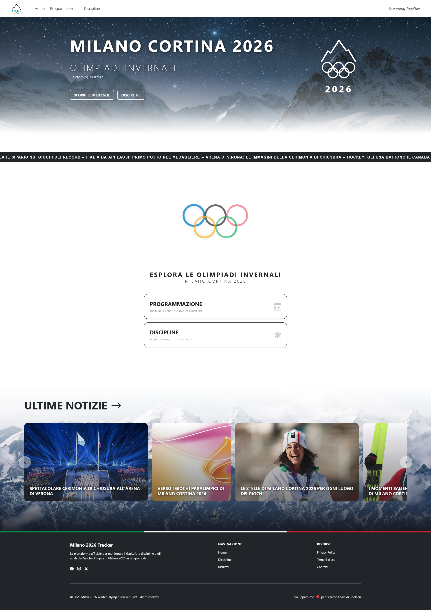
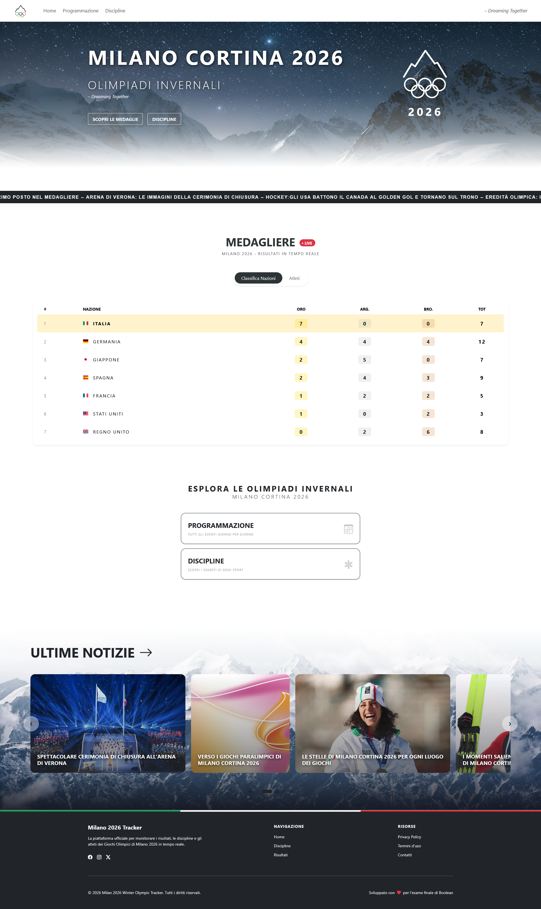
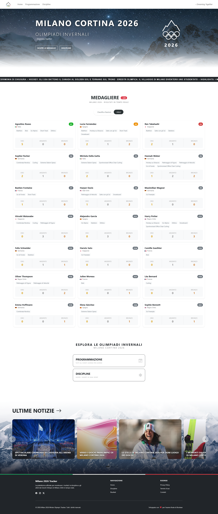
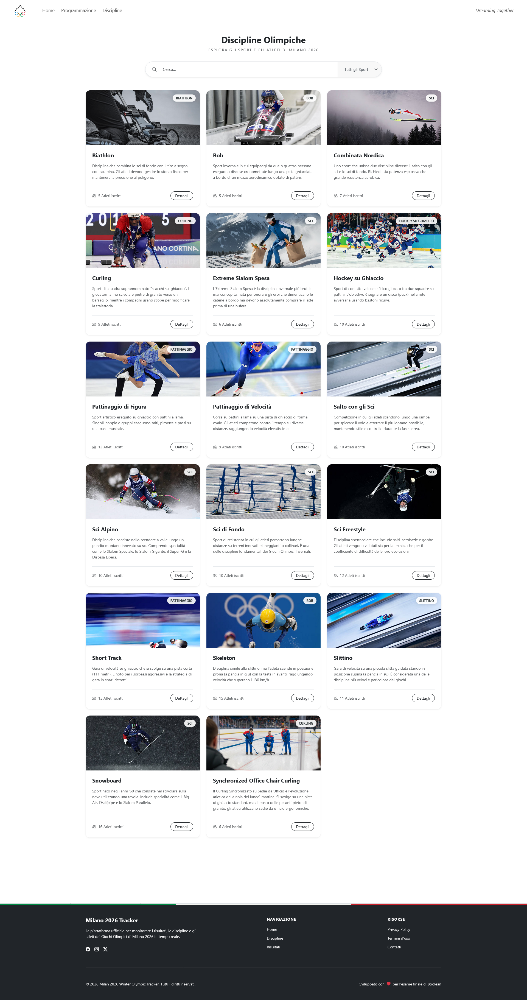
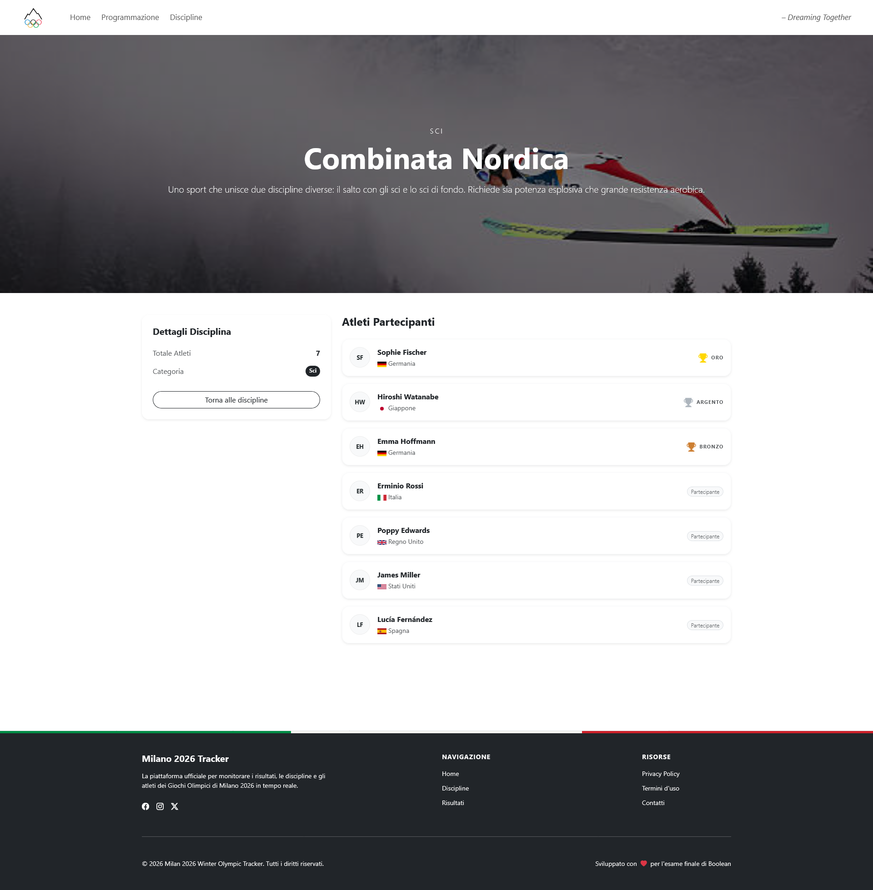
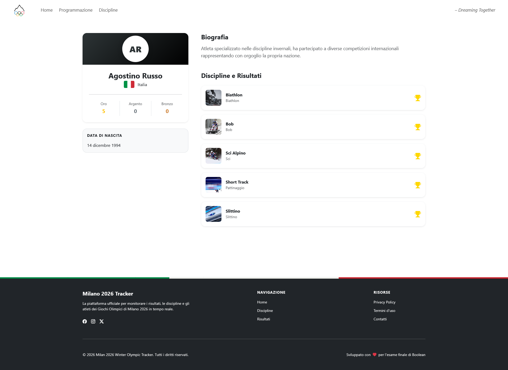

# Winter Olympics Portal

Un portale completo per la gestione e la visualizzazione dei dati relativi alle Olimpiadi Invernali. Il progetto è diviso in un backoffice amministrativo e un frontoffice per l'utente finale.

## 🛠 Tech Stack

- **Backoffice:** [Laravel 10+](https://laravel.com/) (PHP)
- **Frontoffice:** [React](https://reactjs.org/) (con Vite/Next.js)
- **Database:** MySQL
- **Autenticazione:** Laravel Breeze

 

## 🚀 Struttura del Progetto

Il repository è organizzato come segue:
- `/backend`: API REST e logica di business in Laravel.
- `/frontend`: Interfaccia utente sviluppata in React.

 

## 🖼️ Interfaccia Utente (UI)

In questa sezione vengono descritte le principali schermate del portale **Milano Cortina 2026**, che collegano il frontoffice React ai dati gestiti dal backoffice Laravel.

### 1. Homepage: Stati e Visualizzazioni
La schermata iniziale gestisce dinamicamente il caricamento dei dati e permette di switchare tra diverse visualizzazioni del medagliere.

| Homepage (Loader) | Homepage (Medagliere Nazioni) | Homepage (Medagliere Atleti) |
| :--- | :--- | :--- |
|  |  |  |
| **Stato iniziale:** Feedback visivo durante il fetching delle API. | **Vista Nazioni:** Classifica aggregata per Paese (Oro, Argento, Bronzo). | **Vista Atleti:** Ranking basato sulle prestazioni individuali. |

---

### 2. Directory delle Discipline
Pagina di catalogo che elenca tutti gli sport invernali gestiti dal sistema.

| Anteprima Interfaccia | Descrizione e Funzionalità |
| :--- | :--- |
|  | **Caratteristiche:**   &bull; Filtro di ricerca testuale dinamico.   &bull; Filtro per categoria (es. Sci, Pattinaggio).   &bull; Card con contatore atleti in tempo reale. |

---

### 3. Dettaglio Disciplina e Partecipanti
Visualizzazione specifica per ogni sport, con focus sui protagonisti e i risultati.

| Anteprima Interfaccia | Dettagli Tecnici |
| :--- | :--- |
|  | **Contenuti:**   &bull; Descrizione tecnica della disciplina.   &bull; Elenco atleti partecipanti con badge nazione.   &bull; Visualizzazione podio (Oro, Argento, Bronzo). |

---

### 4. Profilo Atleta e Palmarès
Pagina di dettaglio dedicata ai singoli atleti e alla loro storia olimpica.

| Anteprima Interfaccia | Informazioni Gestite |
| :--- | :--- |
|  | **Dati Biografici:**   &bull; Conteggio totale medaglie vinte.   &bull; Biografia estesa e data di nascita.   &bull; **Timeline:** Elenco di tutte le gare disputate e risultati ottenuti. |
